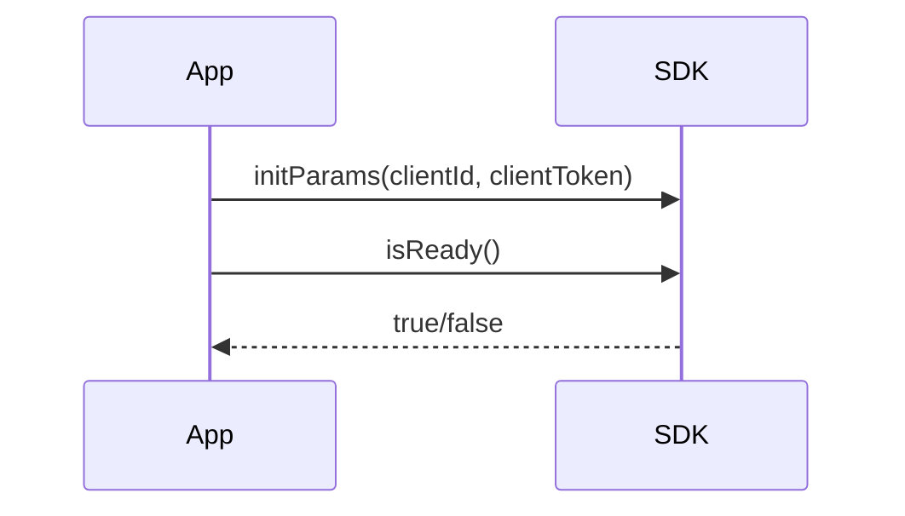
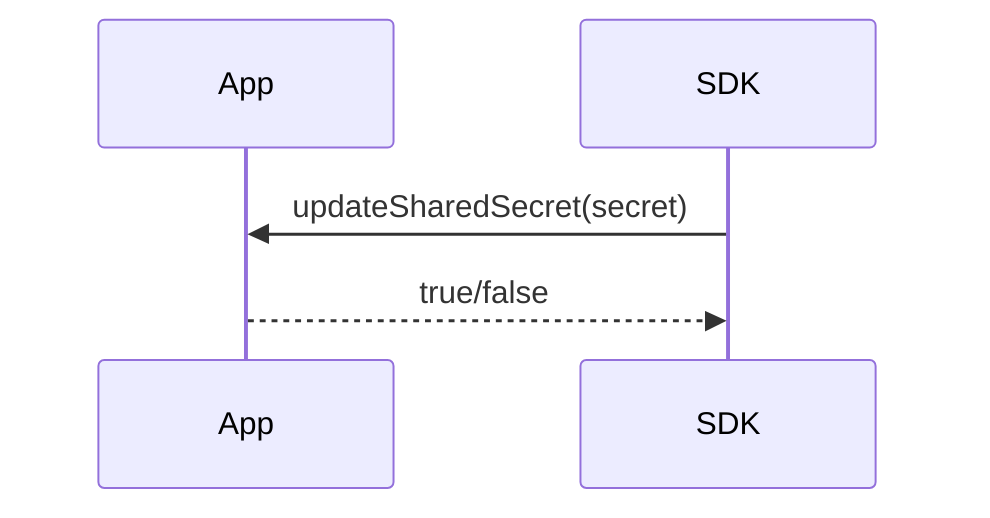
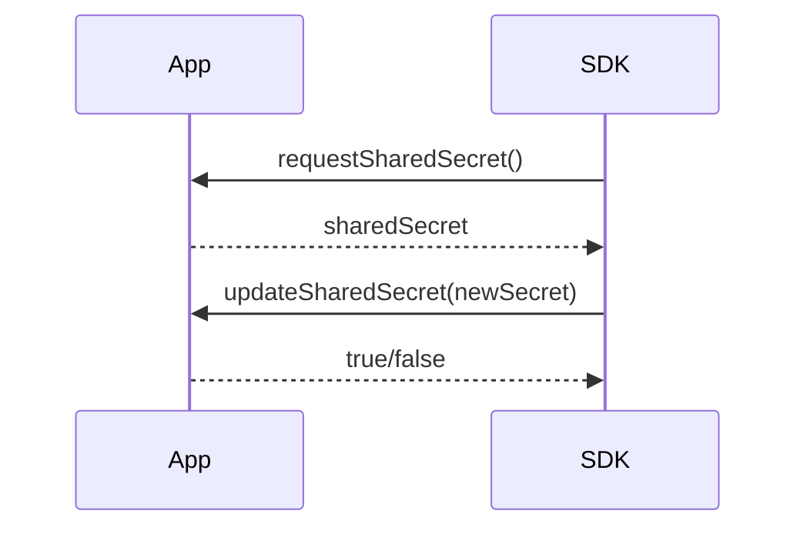
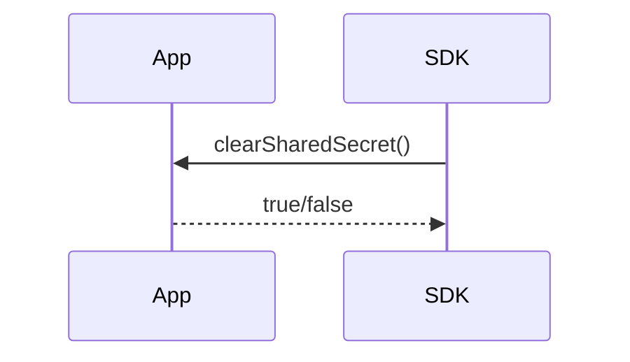
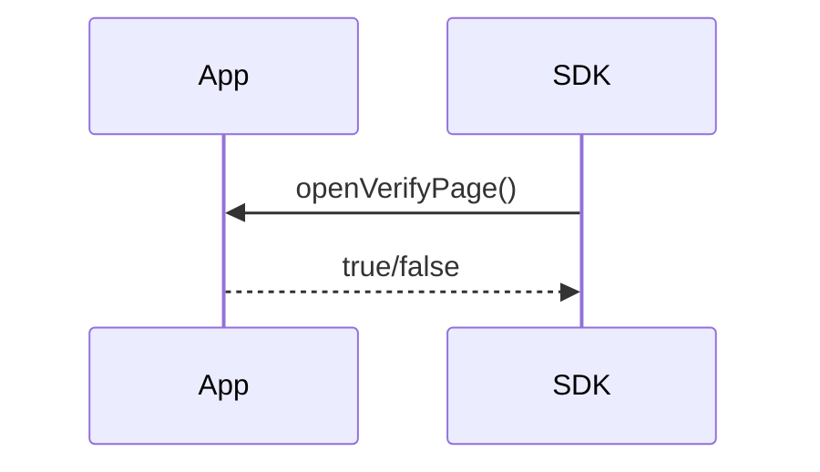

# KryptoGO Mobile Wallet SDK

[](https://github.com/kryptogo/kg-mobile-wallet-sdk)

## Overview

KryptoGO Mobile Wallet SDK allows native apps to integrate KryptoGO wallet functionality.

- [Documentation](https://dora-xies-organization.gitbook.io/KryptoGO Mobile Wallet SDK-doc)
- [GitHub Repository](https://github.com/kryptogo/kg-mobile-wallet-sdk)

## Table of Contents

- [KryptoGO Mobile Wallet SDK](#kryptogo-mobile-wallet-sdk)
  - [Overview](#overview)
  - [Table of Contents](#table-of-contents)
  - [Features](#features)
  - [Supported Platforms](#supported-platforms)
  - [Prerequisites](#prerequisites)
  - [Installing KryptoGO Mobile Wallet SDK](#installing-kryptogo-mobile-wallet-sdk)
  - [Configure initialization parameters:](#configure-initialization-parameters)
  - [SDK Methods](#sdk-methods)
    - [Methods to Handle SDK Requests](#methods-to-handle-sdk-requests)
    - [SDK Methods Available to Users](#sdk-methods-available-to-users)
  - [SDK Flow Overview](#sdk-flow-overview)
    - [1. SDK Initialization](#1-sdk-initialization)
    - [2. SSS Wallet Creation](#2-sss-wallet-creation)
    - [3. SSS Key Fragment Retrieval](#3-sss-key-fragment-retrieval)
    - [4. SSS Backup Failure Handling](#4-sss-backup-failure-handling)
    - [5. Transaction Verification](#5-transaction-verification)
  - [Security Features](#security-features)
  - [Multi-Chain Support](#multi-chain-support)
  - [Sample Projects and SDK Files](#sample-projects-and-sdk-files)
    - [Android Sample](#android-sample)
    - [iOS Sample](#ios-sample)
    - [SDK Files](#sdk-files)
## Features
- Quick Integration and Easy Configuration
- Security and Compliance
- Technical Support and Community
- On-chain Asset Data
- On-chain Transaction Records
- Asset Transfer
- Token Swap
- Password Backup
- SSS Fragmentation Protection Mechanism
- Multi-Chain Support

## Supported Platforms
- iOS
- Android

## Prerequisites
- iOS 14.0+
- Android 5.0+


## Installing KryptoGO Mobile Wallet SDK

1. Clone the SDK repository:

   ```shell
   git clone https://github.com/kryptogo/kg-mobile-wallet-sdk.git
   ```

2. Place the KG_SDK directory into the root directory of your application.

3. Follow the specific configuration documents for iOS and Android to complete the setup.


## Configure initialization parameters:

   | Parameter   | Type   | Description                                        |
   | ----------- | ------ | -------------------------------------------------- |
   | clientId    | String | Your application's client ID provided by KryptoGO  |
   | clientToken | String | Your application's client token for authentication |

## SDK Methods

### Methods to Handle SDK Requests

| Method Name         | Description                                                                                                                                                                                                                                                                                        | Parameters          | Return Value |
| ------------------- | -------------------------------------------------------------------------------------------------------------------------------------------------------------------------------------------------------------------------------------------------------------------------------------------------- | ------------------- | ------------ |
| updateSharedSecret  | Updates the shared secret used in Shamir's Secret Sharing (SSS) scheme. You need ensure that the sharedSecret is saved in your own database. This is crucial for updating the user's private key fragment stored on the device. Return `true` if the save is successful, otherwise return `false`. | String sharedSecret | bool         |
| clearSharedSecret   | Clears the stored shared secret (private key fragment) from the device. This might be used during logout or account reset procedures. Return `true` if the operation is successful, otherwise return `false`.                                                                                      | None                | bool         |
| closeSdkView        | Closes the current SDK view.                                                                                                                                                                                                                                                                       | None                | void         |
| openVerifyPage      | Opens a verification page, typically used when the SDK needs to verify the user's identity before performing sensitive operations related to SSS. Return true if verification is successful, otherwise return false.                                                                               | None                | bool         |
| requestSharedSecret | SDK requests a shared secret (private key fragment) from the app. This is a critical part of the SSS scheme, allowing the SDK to reconstruct the full private key when needed.                                                                                                                     | None                | String       |

### SDK Methods Available to Users
| Method Name         | Description                                                                                                                                                                      | Parameters                 | Return Value |
| ------------------- | -------------------------------------------------------------------------------------------------------------------------------------------------------------------------------- | -------------------------- | ------------ |
| goRoute             | Navigates to a specific route within the SDK's interface. Available routes include: "/receive_address", "/send_token/select_token", "/swap".                                     | String route               | None         |
| initParams          | Initializes the client token and client id, which is used for authentication purposes. `clientId` and `clientToken` are required.                                                | Map<String, String> params | None         |
| checkDevice         | Performs a compatibility check on the device to ensure it meets the SDK's requirements, including the ability to securely store SSS fragments.                                   | None                       | bool         |
| isReady             | Verifies if the SDK is fully initialized and ready for use, including the setup of SSS components.                                                                               | None                       | bool         |
| getAccessToken      | Retrieves the current access token, which is typically used for authenticated API requests.                                                                                      | None                       | String       |
| hasLocalShareKey    | Checks if a local share key (part of the SSS scheme) is stored on the SDK (device). This is crucial for determining if the device has a part of the user's private key.          | None                       | bool         |
| isWalletCreated     | Verifies if a wallet has been created for the current user                                                                                                                       | None                       | bool         |
| getBalance          | Retrieves the current balance of the user's wallet.                                                                                                                              | None                       | String       |
| refreshSharedSecret | Refreshes the shared secret (private key fragment) stored on the device. This might be done periodically for security reasons or when the user wants to update their key shares. | String secret              | None         |

## SDK Flow Overview

The KryptoGO Mobile Wallet SDK interacts with your app through several key flows:

### 1. SDK Initialization
The app calls `initParams` with the `clientId` and `clientToken`. It then checks if the SDK is ready using `isReady()`.



### 2. SSS Wallet Creation

During wallet creation, the SDK calls `updateSharedSecret` to backup the private key fragment to the app's server.



### 3. SSS Key Fragment Retrieval

If the local fragment is missing, the SDK calls `requestSharedSecret` to get the fragment from the app. After reconstructing the private key, it calls `updateSharedSecret` again to re-backup the fragment.



### 4. SSS Backup Failure Handling

If backup fails, all fragments must be destroyed and re-backed up. The SDK calls `clearSharedSecret` to delete old backups in all environments.


### 5. Transaction Verification

Before signing transactions, the SDK calls `openVerifyPage`. If the user successfully verifies in the app, it returns `true` to the SDK.



## Security Features

KryptoGO Mobile Wallet SDK employs advanced protection mechanisms:

- Password Backup
- SSS Fragmentation Protection Mechanism

## Multi-Chain Support

KryptoGO Mobile Wallet SDK supports several blockchain networks:

- Bitcoin
- Ethereum
- Polygon
- Arbitrum
- Solana
- TRON
- KuCoin Community Chain
- Ronin
- Oasys

## Sample Projects and SDK Files

### Android Sample
The Android sample project is located in the `examples/android` directory. It's a standard Android project built with Gradle. The main application code can be found in `app/src/main`.

### iOS Sample
The iOS sample project is located in the `examples/ios` directory. It's a standard iOS project managed with Xcode and CocoaPods. Key files include `ContentView.swift` (main SwiftUI view), `KgSDKService.swift` (KryptoGO SDK service wrapper), and `VerifyPageView.swift` and `VerifyPageViewController.swift` (verification page code).

### SDK Files
SDK files are located in the `sdk` directory, divided into Android and iOS subdirectories. The Android SDK files are in `sdk/android/repo`, while the iOS SDK files are in `sdk/ios/Flutter`, containing framework files for Debug, Profile, and Release configurations.

