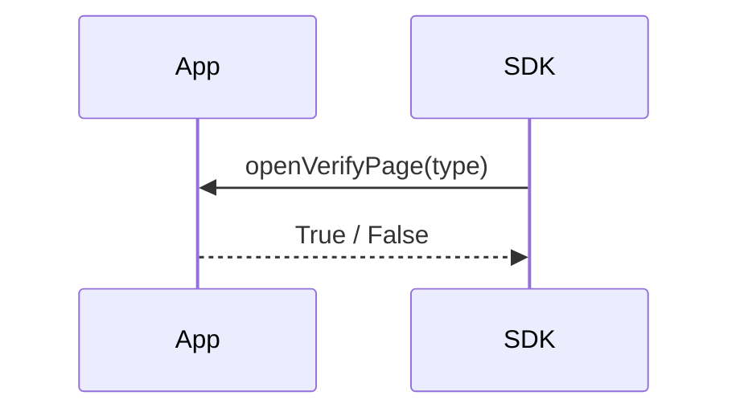

# KryptoGO Mobile Wallet SDK

[](https://github.com/kryptogo/kg-mobile-wallet-sdk)

## Overview

KryptoGO Mobile Wallet SDK allows native apps to integrate KryptoGO wallet functionality.

- [Documentation (Deprecated)](https://dora-xies-organization.gitbook.io/kg_sdk-doc)

## Table of Contents

- [KryptoGO Mobile Wallet SDK](#kryptogo-mobile-wallet-sdk)
  - [Overview](#overview)
  - [Table of Contents](#table-of-contents)
  - [Features](#features)
  - [Supported Platforms](#supported-platforms)
  - [Prerequisites](#prerequisites)
  - [Installing KryptoGO Mobile Wallet SDK](#installing-kryptogo-mobile-wallet-sdk)
  - [Configure initialization parameters:](#configure-initialization-parameters)
  - [SDK Methods](#sdk-methods)
    - [Methods to Handle SDK Requests](#methods-to-handle-sdk-requests)
    - [SDK Methods Available to Users](#sdk-methods-available-to-users)
  - [SDK Flow Overview](#sdk-flow-overview)
    - [1. SDK Initialization](#1-sdk-initialization)
    - [2. SSS Wallet Creation](#2-sss-wallet-creation)
    - [3. SSS Key Fragment Retrieval](#3-sss-key-fragment-retrieval)
    - [4. SSS Backup Failure Handling](#4-sss-backup-failure-handling)
    - [5. Transaction Verification](#5-transaction-verification)
  - [Security Features](#security-features)
  - [Multi-Chain Support](#multi-chain-support)
  - [Sample Projects and SDK Files](#sample-projects-and-sdk-files)
    - [Android Sample](#android-sample)
    - [iOS Sample](#ios-sample)
    - [SDK Files](#sdk-files)
## Features
- Quick Integration and Easy Configuration
- Security and Compliance
- Technical Support and Community
- On-chain Asset Data
- On-chain Transaction Records
- Asset Transfer
- Token Swap
- Password Backup
- SSS Fragmentation Protection Mechanism
- Multi-Chain Support

## Supported Platforms
- iOS
- Android

## Prerequisites
- iOS 14.0+
- Android 5.0+


## Installing KryptoGO Mobile Wallet SDK

1. Clone the SDK repository:

   ```shell
   git clone https://github.com/kryptogo/kg-mobile-wallet-sdk.git
   ```

2. Place the KG_SDK directory into the root directory of your application.

3. Follow the specific configuration documents for iOS and Android to complete the setup.


## Configure initialization parameters:

   | Parameter   | Type   | Description                                        |
   | ----------- | ------ | -------------------------------------------------- |
   | clientId    | String | Your application's client ID provided by KryptoGO  |
   | clientToken | String | Your application's user token for authentication |

## The Format of the shared secret

```
timestamp:secret
```

The shared secret is a string which is combined by 2 parts:
- The first part is the version, timestamp.
- The second part is the secret.


## SDK Methods

### Methods to Handle SDK Requests

| Method Name | Description | Parameters | Return Value |
|-------------|-------------|------------|--------------|
| updateSharedSecret | Updates the shared secret used in Shamir's Secret Sharing (SSS) scheme. You need ensure that the sharedSecret is saved in your own database. This is crucial for updating the user's private key fragment stored on the device. | sharedSecret: String | Bool |
| requestSharedSecret | SDK requests a shared secret (private key fragment) with reason from the app. This is a critical part of the SSS scheme, allowing the SDK to reconstruct the full private key when needed. | reason:<br>• INVALID_DEVICE: user device is not consistent<br>• NO_LOCAL_SECRET: no local share key<br>• INVALID_LOCAL_SECRET: local share key is invalid | String |
| clearSharedSecret | Clears the stored shared secret (private key fragment) from your own database. This might be used during account deletion or account reset procedures. | version: String | Bool |
| openVerifyPage | Opens a verification page, typically used when the SDK needs to verify the user's identity before performing sensitive operations related to SSS. | None | Bool |
| closeSdkView | Closes the current SDK view. | None | None |

### SDK Methods Available to Users

| Method Name | Description | Parameters | Return Value | Error Code |
|-------------|-------------|------------|--------------|------------|
| init | An asynchronous method that initializes SDK data and authenticates the KryptoGO wallet account.<br><font color=#FF0000>\*This method should be called first before other methods. | {<br>clientId: String,<br>clientToken: String<br>} | Success: {success: true}<br>Fail: {<br>success: false,<br>reason: INVALID_DEVICE / NO_LOCAL_SECRET / INVALID_LOCAL_SECRET<br>} | • ARGUMENT_ERROR<br>• CONFIG_ERROR<br>• NETWORK_ERROR<br>• API_ERROR<br>• WALLET_STATUS_ERROR<br>• WALLET_RESTORATION_ERROR<br>• UNKNOWN_ERROR |
| isReady | Verifies whether the SDK is fully initialized and ready for use, including the setup of SSS components.<br><font color=#FF0000>\*This method should be called to check before open the SDK view. | None | Bool | None |
| checkDevice | Performs user device verification to check if the current device is consistent. | None | Bool | • NOT_READY<br>• NETWORK_ERROR<br>• API_ERROR<br>• UNKNOWN_ERROR |
| isWalletCreated | Verifies if a wallet has been created for the current user | None | Bool | • NOT_READY<br>• UNKNOWN_ERROR |
| getBalance | Retrieves the current balance of the user's wallet. | None | String | • NOT_READY<br>• NETWORK_ERROR<br>• API_ERROR<br>• UNKNOWN_ERROR |
| refreshSharedSecret | Refreshes the shared secret (private key fragment) stored on the device. This might be done periodically for security reasons or when the user wants to update their key shares. | secret: String | Bool | • ARGUMENT_ERROR<br>• NETWORK_ERROR<br>• API_ERROR<br>• WALLET_RESTORATION_ERROR<br>• SECRET_BACKUP_ERROR<br>• UNKNOWN_ERROR |
| openView | Navigates to a specific view within the SDK's interface. Available locations:<br>• "/receive_address"<br>• "/send_token/select_token"<br>• "/swap" | location: String | None | • ARGUMENT_ERROR<br>• NOT_READY<br>• UNKNOWN_ERROR |

### Error Code
#### Common
 - INVALID_ARGUMENT: Invalid argument provided to the method.
 - NOT_READY: SDK is not initialized or not ready for operations.
 - NETWORK_ERROR: Network-related error, such as inability to connect to the server or unstable connection.
 - API_ERROR: API request failed, possibly due to server returning an error status code or data format issues.
 - UNKNOWN_ERROR: Unknown error occurred.
#### Initialization
 - CONFIG_ERROR: SDK initialization configuration error.
 - WALLET_STATUS_ERROR: Error occurred during the wallet status check.

#### Share Secret / Wallet Restoration
 - SECRET_VERSION_ERROR: Shared secret version mismatch or error, leading to refresh or update failure.
 - SECRET_BACKUP_ERROR: Error occurred during the backup process of the shared secret, possibly due to cloud or local backup failure.
 - WALLET_RESTORATION_ERROR: Error occurred during the wallet restoration process.


## SDK Flow Overview

The KryptoGO Mobile Wallet SDK interacts with your app through several key flows:

### 1. SDK Initialization
The app calls `init` with the `clientId` and `clientToken`. The SDK will initiate the configuration and wallet login process.
It will return `{success: true}` when success, or `{success: false, reason: reason}` with reason or Error when failed.
It then checks if the SDK is ready using `isReady()`.


### 2. Check device consistency
The app calls `checkDevice()` to verify if the current device is consistent.
It will return `true` when success, or Error when failed.


### 3. Check if wallet is created
The app calls `isWalletCreated()` to check if the wallet is created.
It will return `true` when success, or Error when failed.


### 4. Get balance
The app calls `getBalance()` to get the balance of the wallet.
It will return the balance of the wallet, or Error when failed.


### 5. SSS Backup refreshing
The app can call refreshSharedSecret and pass the original backed up secret to request the SDK to refresh SSS key fragments and re-backup.
It will return new version of secret when success, or Error when failed.


### 6. Transaction Verification

Before signing transactions, the SDK calls `openVerifyPage` with transaction type. If the user successfully verifies in the app, it returns `true` to the SDK.

```mermaid
sequenceDiagram
participant App
participant SDK
SDK->>App: openVerifyPage(type)
App-->>SDK: True / False
```


## Security Features

KryptoGO Mobile Wallet SDK employs advanced protection mechanisms:

- Password Backup
- SSS Fragmentation Protection Mechanism

## Multi-Chain Support

KryptoGO Mobile Wallet SDK supports several blockchain networks:

- Bitcoin
- Ethereum
- Polygon
- Arbitrum
- Solana
- TRON
- Ronin
- Oasys

## Sample Projects and SDK Files

### Android Sample
The Android sample project is located in the `examples/android` directory. It's a standard Android project built with Gradle. The main application code can be found in `app/src/main`.

### iOS Sample
The iOS sample project is located in the `examples/ios` directory. It's a standard iOS project managed with Xcode and CocoaPods. Key files include `ContentView.swift` (main SwiftUI view), `KgSDKService.swift` (KryptoGO SDK service wrapper), and `VerifyPageView.swift` and `VerifyPageViewController.swift` (verification page code).

### SDK Files
SDK files are located in the `sdk` directory, divided into Android and iOS subdirectories. The Android SDK files are in `sdk/android/repo`, while the iOS SDK files are in `sdk/ios/Flutter`, containing framework files for Debug, Profile, and Release configurations.

