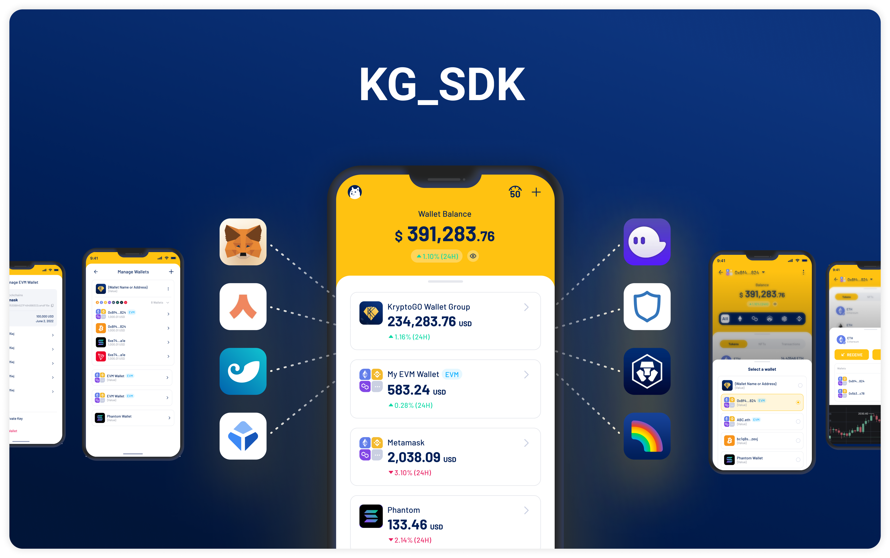

# KG\_SDK

KG\_SDK integrates KryptoGO wallet functionality into applications, providing Web3 capabilities for secure asset management with an intuitive user interface.

## Features

### Quick Integration and Easy Configuration

Developers can implement wallet features with minimal code without deep blockchain knowledge.

### Security and Compliance

The SDK enables decentralized wallets, giving users complete control over funds. It meets current security standards and regulations with regular updates.

### Technical Support and Community

Users gain access to developer community resources and professional support.

## Core Functions

- On-chain asset data viewing
- Transaction history tracking
- Asset transfer functionality
- Token swap features

## Security Features

- **Password backup** — wallet restoration
- **SSS Fragmentation** — splits private keys into separate fragments for protection

## Multi-Chain Support

Supported blockchains:

- Bitcoin
- Ethereum
- Polygon
- Arbitrum
- Solana
- TRON
- KuCoin Community Chain
- Ronin
- Oasys

## Next Steps

- [Get Started](get-started.md)
